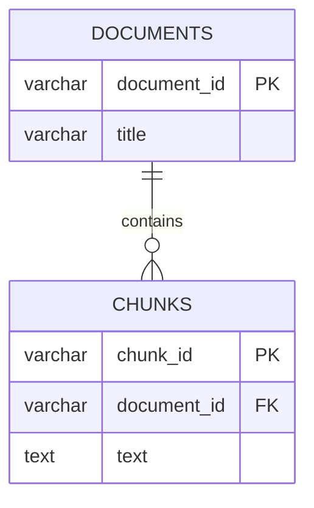
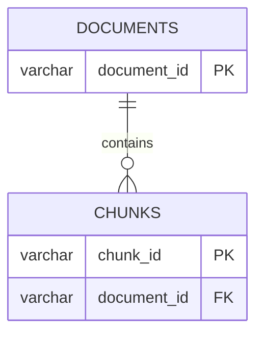
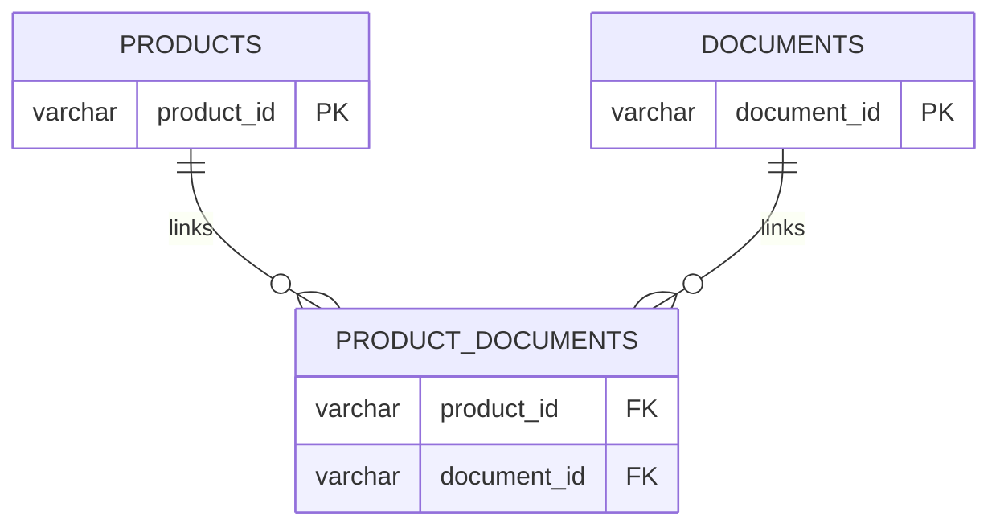

# 04 產品與 SOP：PK、FK 與資料關係

> **定位**：用 PK、FK、document、chunk 與關聯表，理解產品與 SOP 的資料關係。

## 本章資料表與欄位參照

以下用接近 `SHOW CREATE TABLE` 的方式，先列出本章會用到的資料表、重要欄位、型別與約束。正式操作時，仍以你在自己的 MariaDB 執行結果為準。

### `products`

```sql
CREATE TABLE products (
    product_id  VARCHAR(16)  PRIMARY KEY,
    category_id INT          NOT NULL,
    name        VARCHAR(255) NOT NULL,
    price       DECIMAL(10,2) NOT NULL,
    stock       INT          NOT NULL,
    FOREIGN KEY (category_id) REFERENCES categories(category_id)
);
```

| column | 型別 | 約束 | 用途 |
|---|---|---|---|
| `product_id` | `VARCHAR(16)` | PK | 產品的固定 ID |
| `category_id` | `INT` | FK | 指向 `categories.category_id` |
| `name` | `VARCHAR(255)` | `NOT NULL` | 產品名稱 |
| `price` | `DECIMAL(10,2)` | `NOT NULL` | 產品價格 |
| `stock` | `INT` | `NOT NULL` | 庫存數量 |

### `documents`

```sql
CREATE TABLE documents (
    document_id    VARCHAR(16)  PRIMARY KEY,
    title          VARCHAR(255) NOT NULL,
    source_version INT          NOT NULL,
    status         VARCHAR(16)  NOT NULL
);
```

| column | 型別 | 約束 | 用途 |
|---|---|---|---|
| `document_id` | `VARCHAR(16)` | PK | SOP 的固定 ID |
| `title` | `VARCHAR(255)` | `NOT NULL` | SOP 標題 |
| `source_version` | `INT` | `NOT NULL` | SOP 版本 |
| `status` | `VARCHAR(16)` | `NOT NULL` | 文件狀態，例如 `active`、`inactive` |

### `chunks`

```sql
CREATE TABLE chunks (
    chunk_id       VARCHAR(16) PRIMARY KEY,
    document_id    VARCHAR(16) NOT NULL,
    source_version INT         NOT NULL,
    text           TEXT        NOT NULL,
    content_hash   CHAR(64)    NOT NULL,
    FOREIGN KEY (document_id) REFERENCES documents(document_id)
);
```

| column | 型別 | 約束 | 用途 |
|---|---|---|---|
| `chunk_id` | `VARCHAR(16)` | PK | 段落的固定 ID |
| `document_id` | `VARCHAR(16)` | FK、`NOT NULL` | 指向 `documents.document_id` |
| `source_version` | `INT` | `NOT NULL` | 段落所屬的文件版本 |
| `text` | `TEXT` | `NOT NULL` | 段落原文 |
| `content_hash` | `CHAR(64)` | `NOT NULL` | 段落原文的 hash value |

### `product_documents`

```sql
CREATE TABLE product_documents (
    product_id  VARCHAR(16) NOT NULL,
    document_id VARCHAR(16) NOT NULL,
    PRIMARY KEY (product_id, document_id),
    FOREIGN KEY (product_id) REFERENCES products(product_id),
    FOREIGN KEY (document_id) REFERENCES documents(document_id)
);
```

| column | 型別 | 約束 | 用途 |
|---|---|---|---|
| `product_id` | `VARCHAR(16)` | 複合 PK、FK | 指向 `products.product_id` |
| `document_id` | `VARCHAR(16)` | 複合 PK、FK | 指向 `documents.document_id` |

本章閱讀表結構時，先問三個問題：

```text
這個 column 是哪一張 table 的 PK？
這個 column 是否是 FK？如果是，它 REFERENCES 哪裡？
這一列資料代表什麼？
```


## 本章要做什麼？

本章只做三件事：

```text
1. 看懂 PK 與 FK
2. 看懂一對多：document → chunks
3. 看懂多對多：products ↔ documents
```

本章的主線是：

```text
產品
  ↓
產品與 SOP 的關聯
  ↓
SOP 文件
  ↓
SOP 段落 chunk
```

---

## 1. PK 與 FK 的定義

### PK：我是哪一筆資料？

PK 是 Primary Key，主鍵。

> PK 用來唯一識別資料表中的一筆資料列。

例如 `documents`：

```text
document_id 是 documents 的 PK

D001：一份 SOP
D002：另一份 SOP
```

### FK：我連到哪一筆別人的資料？

FK 是 Foreign Key，外鍵。

> FK 是目前資料表中的欄位，用來記錄另一張資料表的 PK。

例如：



可以讀成：

```text
chunks.document_id
→ 記錄它所屬的 documents.document_id
```

---

## Workshop

## 2. Checkpoint 1：查詢 chunks 的 PK 與 FK

先查看 `chunks` 表的完整定義：

```sql
SHOW CREATE TABLE chunks;
```

請在輸出中找：

```text
PRIMARY KEY (`chunk_id`)
FOREIGN KEY (`document_id`)
  REFERENCES `documents` (`document_id`)
```

完成填空：

```text
chunks.chunk_id 是 ____________________。
chunks.document_id 是 ________________。
```

預期答案：

```text
chunks.chunk_id 是 chunks 表的 PK。
chunks.document_id 是 FK，指向 documents.document_id。
```

### 語法小表

| 語法 | 簡單意思 |
|---|---|
| `SHOW CREATE TABLE` | 查看資料表的建立定義 |
| `PRIMARY KEY` | 宣告主鍵 |
| `FOREIGN KEY` | 宣告外鍵 |
| `REFERENCES` | 說明外鍵指向哪張表、哪個欄位 |

---

## 3. 一對多：一份文件有多個 chunks

一份 SOP 文件可以拆成多個段落：



這是：

```text
一個 document
→ 多個 chunks
```

查詢 D002 的段落：

```sql
SELECT chunk_id, document_id, source_version
FROM chunks
WHERE document_id = 'D002'
ORDER BY chunk_id;
```

預期：

```text
C003  D002  1
C004  D002  1
```

這裡的 `chunk` 很重要，因為後面的 Embedding 與向量檢索會以 chunk 作為搜尋單位，而不是直接把整份 SOP 當成一筆資料。

未來簡化的 LLM RAG 流程：

```text
使用者問題
→ 找到相關 chunks
→ 提供給 LLM
→ LLM 根據 chunks 產生回答
```

RAG 是 Retrieval-Augmented Generation，也就是「檢索增強生成」：先找自己的資料，再讓 LLM 根據找到的內容產生回答。

---

## 4. Checkpoint 2：確認一對多關係

請回答：

```text
D002 被拆成哪些 chunks？
```

預期：

```text
D002 被拆成 C003 與 C004；兩個段落都是 source_version 1。
```

再用一句話說明：

```text
chunks.document_id 的用途是什麼？
```

預期：

```text
它記錄每個 chunk 所屬的 document。
```

---

## 5. 多對多：產品與 SOP

一個產品可以使用多份 SOP；一份 SOP 也可以被多個產品使用。

> **我對你是一對多，你對我也是一對多。**

```text
一個 product → 多份 document
一份 document → 多個 product
```

這兩個方向同時成立，所以整體叫做「多對多」。



### 為什麼需要中間的關聯表？

因為產品與 SOP 都可能對應多筆資料。`product_documents` 把每一組配對獨立成一列：

```text
一列 = 一個 product + 一個 document
```

因此可以保存：

```text
P001 / D001
P001 / D005
P002 / D001
```

這樣兩個 ID 都能用 FK 驗證真的存在，也能從產品查文件、從文件反查產品。

```text
product_documents
┌────────────┬─────────────┐
│ product_id │ document_id │
├────────────┼─────────────┤
│ P001       │ D001        │
│ P001       │ D005        │
│ P002       │ D001        │
└────────────┴─────────────┘
```

兩個欄位都是 FK：

```text
product_documents.product_id
→ products.product_id

product_documents.document_id
→ documents.document_id
```

---

## 6. Checkpoint 3：查詢多對多關係

查詢 P001 使用哪些 SOP：

```sql
SELECT product_id, document_id
FROM product_documents
WHERE product_id = 'P001'
ORDER BY document_id;
```

預期：

```text
P001 / D001
P001 / D005
```

反過來查詢 D001 被哪些產品使用：

```sql
SELECT product_id, document_id
FROM product_documents
WHERE document_id = 'D001'
ORDER BY product_id;
```

預期：

```text
P001 / D001
P002 / D001
```

請回答：

```text
P001 使用哪些 SOP？
D001 被哪些產品使用？
為什麼需要 product_documents？
```

預期：

```text
P001 使用 D001、D005。
D001 被 P001、P002 使用。
因為 products 與 documents 是多對多關係。
```

---

## 本章完成條件

```text
Checkpoint 1：能從 SHOW CREATE TABLE 找出 PK 與 FK
Checkpoint 2：能說明 D002 → C003、C004
Checkpoint 3：能查出 P001 的文件與 D001 的產品
```

## 教學圖片參考


