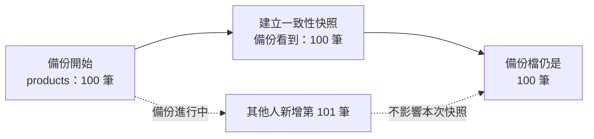

# 15 備份與還原：檔案存在不代表救得回資料

> **定位**：備份六張核心普通表，還原到空白隔離庫，再用 checksum、計數與完整 dump 比對驗證。

## 學習目標

完成本節後，你應該能夠：

- 分辨備份檔案、checksum 與還原演練各自證明什麼
- 用受限的 `course_editor` 完成指定範圍備份
- 確認還原目標為空，不覆蓋舊備份或非空資料庫
- 說明這次備份沒有涵蓋哪些物件
- 用完整 dump 比對，而不只看檔案存在或資料筆數

## 範例程式碼

- [公開 demo repo](https://github.com/4-learn/mariadb-demo)：教師示範與學生練習。
- [Workshop repo](https://github.com/4-learn/mariadb-workshop)：目前為私有考試題庫；課程結束後會公開，請保留此連結。

本節執行檔案：

```text
demo/15-backup-restore.sh
```

它使用 `course_editor`，不使用 root，也不讓 `course_app` 執行 DDL。

---

## 情境

有人拿出 `backup.sql` 說「昨天有備份」，但檔案可能是：

```text
零位元組
只含結構
備錯資料庫
還原時權限不足
根本無法重建資料
```

本節要證明的不是檔名存在，而是：

```text
指定範圍能從來源 dump 還原到空白資料庫
還原後的結構與資料能再次產生相同 dump
```

### 本節範圍

來源：

```text
mariadb_workshop_2026
```

目標：

```text
mariadb_restore_2026
```

備份六張核心普通表：

```text
categories
products
course_meta
documents
product_documents
chunks
```

不包含：

```text
practice 表
帳號與 GRANT
views、triggers、routines、events
server 設定、binlog／PITR
向量表與向量索引
```

這是核心資料集的邏輯備份，不是整台 MariaDB server 的災難復原。

---

## 講解

### 1. 確認 editor 與空白目標

教師必須先確認還原庫是空白，並暫停來源與目標的其他寫入／DDL。

設定檔：

```text
$HOME/mariadb-course-editor.cnf
```

權限應為：

```text
0600
```

登入時用命令列最後的資料庫名稱指定來源或目標；不要假設設定檔含有 `database`。

### 2. 逐段執行備份與還原

先在 `mariadb-demo` 根目錄建立新的私密輸出目錄。目錄必須尚不存在：

```bash
cd ~/workspace/mariadb-demo
backup_dir="$HOME/mariadb-core-backup-15"
mkdir -- "$backup_dir"
chmod 700 "$backup_dir"
```

設定要備份的資料表：

```bash
source_db=mariadb_workshop_2026
restore_db=mariadb_restore_2026
tables=(categories products course_meta documents product_documents chunks)
```

先確認來源身分與目標資料庫為空：

```bash
mariadb --defaults-file="$HOME/mariadb-course-editor.cnf" \
  --default-character-set=utf8mb4 "$source_db" \
  -e "SELECT CURRENT_USER(), DATABASE();"

mariadb --defaults-file="$HOME/mariadb-course-editor.cnf" \
  --default-character-set=utf8mb4 "$restore_db" \
  -e "SELECT COUNT(*) FROM information_schema.TABLES WHERE TABLE_SCHEMA=DATABASE();"
```

目標資料庫的資料表數應為 `0`。如果不是 0，先停止，不能覆蓋或刪除資料。

### 3. 執行 `mariadb-dump`

先教最小可用的備份命令：

```bash
mariadb-dump \
  --defaults-file="$HOME/mariadb-course-editor.cnf" \
  --single-transaction \
  --skip-add-drop-table \
  --skip-add-locks \
  --skip-lock-tables \
  "$source_db" categories products course_meta documents product_documents chunks \
  > "$backup_dir/core.sql"
```

這段命令的重點只有四個：

| 部分 | 白話意思 |
|---|---|
| `mariadb-dump` | MariaDB 的備份工具，把資料輸出成 SQL 檔案 |
| `--defaults-file=...` | 使用課程帳號設定檔連線，不在命令列輸入密碼 |
| `--single-transaction` | 對 InnoDB 建立一致性的讀取快照 |
| `--skip-add-drop-table` | 不在備份檔加入刪除資料表的指令，避免還原需要 `DROP` 權限 |
| `--skip-add-locks` | 不在備份檔加入 `LOCK TABLES` 指令 |
| `--skip-lock-tables` | 備份時不使用資料表鎖定，配合本課的 InnoDB 交易快照 |

用下面的圖理解「快照」：



> `--single-transaction`：備份從開始的快照讀取，不會讀到一半變成前後不一致。

| 資料庫名稱與表名 | 指定要備份哪個資料庫、哪些資料表 |
| `>` | 把命令輸出寫入 `core.sql` |

因為 `course_editor` 沒有 `DROP` 與資料表鎖定權限，本課必須使用 `--skip-add-drop-table`、`--skip-add-locks` 與 `--skip-lock-tables`。如果先前已經用舊命令產生 `core.sql`，請重新產生備份檔，不要直接重複還原舊檔：

```bash
rm -f "$backup_dir/core.sql" "$backup_dir/core.sql.sha256" "$backup_dir/restored.sql"
```

再執行上面的 `mariadb-dump` 命令。

先確認備份檔不是空的：

```bash
test -s "$backup_dir/core.sql"
```

本節先不要求背誦其他輸出格式參數。公開的 `demo/15-backup-restore.sh` 為了讓備份檔可以穩定比較，會額外使用一些參數；那些是自動驗收工具的實作細節，不是本節核心。

### 4. 建立與驗證 checksum

先為備份檔建立 checksum：

```bash
sha256sum "$backup_dir/core.sql" > "$backup_dir/core.sql.sha256"
sha256sum --check "$backup_dir/core.sql.sha256"
```

預期看到：

```text
/home/學生帳號/mariadb-core-backup-15/core.sql: OK
```

checksum 證明：

```text
目前的 core.sql 與建立 checksum 時的檔案位元組相同
```

但 checksum 不能單獨證明：

```text
備份選對資料庫
備份範圍完整
檔案可以成功還原
資料內容正確
```

checksum 證明：

```text
目前的 core.sql 與建立 checksum 時的檔案位元組相同
```

但 checksum 不能單獨證明：

```text
備份選對資料庫
備份範圍完整
檔案可以成功還原
資料內容正確
```

### 5. 還原與完整比對

把 `core.sql` 還原到空白的 `mariadb_restore_2026`：

```bash
mariadb --defaults-file="$HOME/mariadb-course-editor.cnf" \
  --default-character-set=utf8mb4 \
  "$restore_db" < "$backup_dir/core.sql"
```

再從還原庫產生第二份 dump：

```bash
mariadb-dump --defaults-file="$HOME/mariadb-course-editor.cnf" \
  --default-character-set=utf8mb4 \
  --skip-add-drop-table --skip-add-locks --skip-lock-tables \
  --no-tablespaces --skip-triggers --single-transaction \
  --skip-comments --skip-dump-date --skip-extended-insert \
  --order-by-primary --hex-blob \
  "$restore_db" "${tables[@]}" > "$backup_dir/restored.sql"
```

最後比較兩份 dump：

```bash
cmp "$backup_dir/core.sql" "$backup_dir/restored.sql"
```

`cmp` 沒有輸出且退出碼為 0，代表兩份檔案相同。`cmp` 成功代表在相同 server／client、相同 dump 參數與停止寫入的條件下，兩份 deterministic dump 的結構與資料一致。

這比只比較數量更完整：

```text
COUNT 一樣，不代表文字內容一樣
```

### 6. 預期成功輸出

```text
/home/學生帳號/mariadb-core-backup-15/core.sql: OK
VERIFIED: six core tables, schema and rows match restored dump
12    8    16    2
Scope: six named ordinary tables only; excludes practice tables, accounts, grants, triggers, routines, events and vectors.
```

四個數字依序是：

```text
products
 documents
chunks
course_meta
```

### 7. 非空目標必須拒絕

成功還原後，不要再次把同一份 dump 貼入同一個 restore 庫。

可以用新的輸出目錄測試拒絕：

```bash
bash demo/15-backup-restore.sh "$HOME/mariadb-core-backup-15-second"
```

預期：

```text
restore database must be empty; no DROP attempted
```

退出碼應為：

```text
1
```

原本的 checksum 仍應通過。不要加 `--force`、不要 `DROP DATABASE`，也不要用 root 解決問題。

---

## 每次上課前：教師重設還原庫

`demo/15-backup-restore.sh` 會把資料還原到 `mariadb_restore_2026`。成功一次後，這個資料庫就不再是空的；下一次上課前，教師必須先重設它。

這個動作會刪除並重新建立還原資料庫，只能由教師或 Ubuntu 管理者執行：

```bash
cd ~/workspace/mariadb-demo
sudo bash demo/15-reset-restore-db.sh
```

腳本會要求輸入：

```text
RESET mariadb_restore_2026
```

成功後應看到：

```text
RESET OK: mariadb_restore_2026 is empty and ready for Ch15
```

學生不要自行修改 `course_editor` 權限，也不要用 `DROP DATABASE` 清理資料。

---

## Workshop

### 題目

在教師確認空白 restore 庫、停止並行寫入後：

1. 依第 2～5 節逐段建立備份、checksum 與還原結果。
2. 保存 checksum、`cmp` 結果、計數與來源／目標資料庫名稱。
3. 最後執行 `demo/15-backup-restore.sh` 一次，作為自動驗收。
4. 使用另一個尚不存在的輸出目錄重跑，確認非空 restore 庫被拒絕。
5. 說明 checksum、restore 與 `cmp` 各自證明什麼。
6. 列出至少三種本節不涵蓋的物件。

執行：

```bash
cd ~/workspace/mariadb-demo
bash demo/15-backup-restore.sh "$HOME/mariadb-core-backup-15"
```

### 預期輸出

```text
VERIFIED: six core tables, schema and rows match restored dump
12    8    16    2
```

非空目標重跑：

```text
restore database must be empty; no DROP attempted
exit code = 1
```

### 交件

提交：

- checksum 成功結果
- restore 成功結果
- `cmp` 退出碼
- products／documents／chunks／course_meta 計數
- 非空目標拒絕結果
- 備份範圍與排除項目說明

不要提交 `core.sql`、密碼、私人設定檔或含資料內容的公開截圖。

### 解答

- [Workshop repo](https://github.com/4-learn/mariadb-workshop)：目前為私有考試題庫；課程結束後會公開，請保留此連結。
